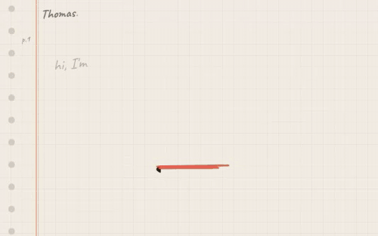
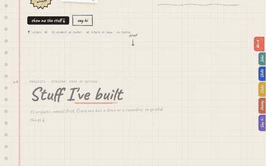
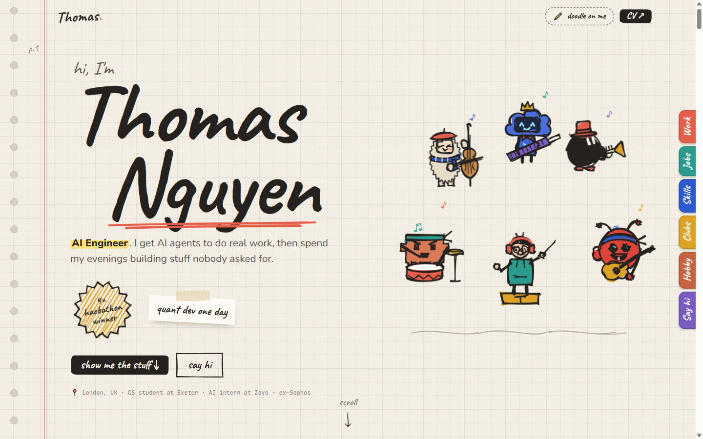
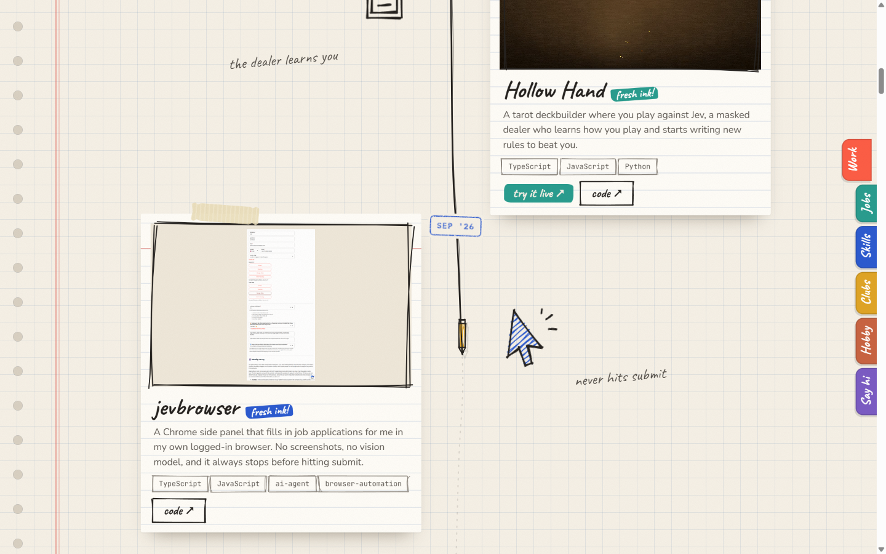
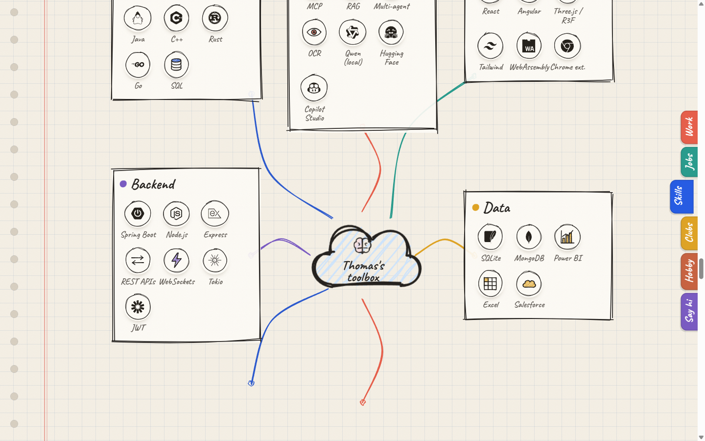
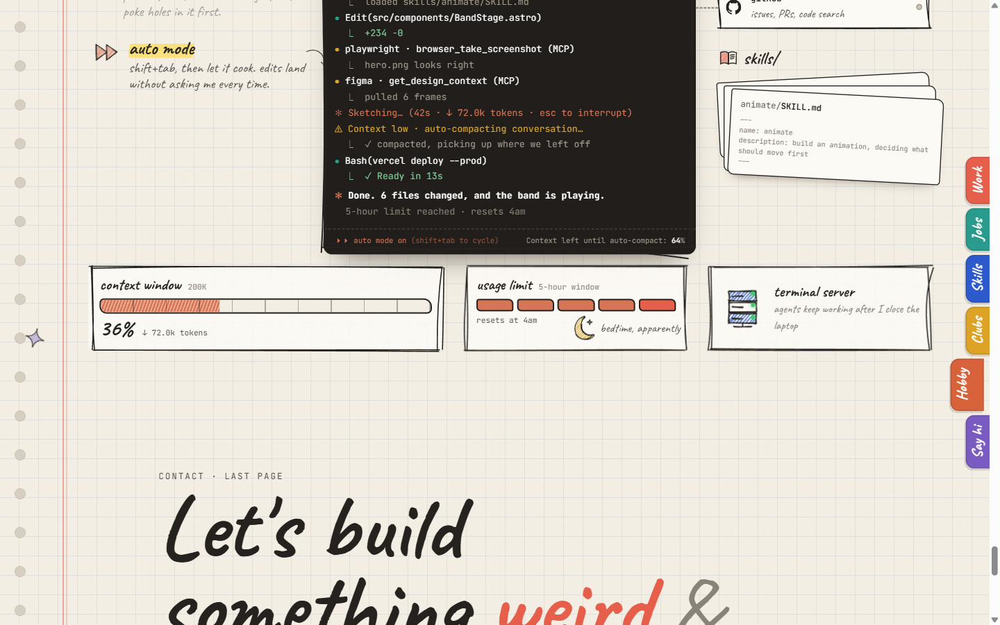

# Thomas's sketchbook ✎

My portfolio, drawn in pencil. Well, drawn in code that pretends to be a pencil.

**Live:** [thomas-portfolio-ruby.vercel.app](https://thomas-portfolio-ruby.vercel.app)

<p align="center">
  
</p>

A pencil writes my name, then I conduct my band (Clawd, Muse, Codex, Grok and OpenClaw) while they play drums, cello, keytar, trumpet and guitar. Click me to change the tempo, hover one of them for a solo.

## The whole thing, scrolled

<p align="center">
  
</p>

<sub>Sped up 1.7×. [Full-speed recording (mp4)](docs/media/demo.mp4).</sub>

| | |
| --- | --- |
|  |  |
|  |  |

## What's going on in there

- **Everything is hand-drawn by code.** Doodles are simple SVG paths that [Rough.js](https://roughjs.com) turns into pencil sketches at build time, so there's zero runtime cost. Each one is rendered with three random seeds and flipped between them at ~7fps, which gives that shaky "line boil" you see in old cartoons.
- **The band** is six characters on a 120×120 canvas. Their faces and accessories are generated from anchor points (eyes, mouth, top of head, hand), so any of them can wink, fall asleep, wear a grad cap or hold a coffee. They show up all over the page in different moods.
- **The project timeline** is a pencil that literally draws the spine as you scroll, and the month stamps slam down as it passes them. Projects are synced straight from my GitHub, recordings included.
- **Numbers get circled.** [rough-notation](https://github.com/rough-stuff/rough-notation) circles, boxes and highlights the stats on the job cards once they settle.
- **The hobby section** pins a fake Claude Code terminal and scrubs a whole session with your scroll: plan mode, auto mode, a skill loading, MCP servers lighting up, the context window filling up and auto-compacting, and the 5-hour limit kicking in at 4am. Scroll back and it rewinds.
- **Doodle on me.** Hit the button (or press `D`) and draw on the page with a pressure-sensitive pen ([perfect-freehand](https://github.com/steveruizok/perfect-freehand)). Your strokes fade after a few seconds.
- **Copy my email** and it folds into a paper plane and flies off.
- **Reduced motion is respected.** With `prefers-reduced-motion`, everything shows up already drawn and nothing moves.

## Stack

[Astro](https://astro.build) (static) · Tailwind v4 · [GSAP](https://gsap.com) + ScrollTrigger · Rough.js · rough-notation · perfect-freehand · [Lenis](https://github.com/darkroomengineering/lenis) · [Simple Icons](https://simpleicons.org) · Vercel

## Run it

```bash
npm install
npm run dev        # localhost:4321
npm run build      # static site in dist/
```

Pull fresh projects from GitHub (needs the `gh` CLI, logged in):

```bash
npm run sync:projects -- --days 7
```

It grabs public repos I've committed to recently, picks the best media from each README (video, then gif, then screenshot), downloads it into `public/projects/`, and writes `src/content/projects.json`. Hand edits to titles, blurbs and tags survive re-syncs.

## Where things live

```
src/
  content/portfolio.ts     # me: jobs, clubs, skills, education
  content/projects.json    # projects (synced)
  lib/doodles.ts           # doodle shapes (100×100 SVG paths)
  lib/characters.ts        # the band + expressions/accessories
  lib/sketch.ts            # Rough.js at build time
  components/              # Doodle, Character, BandStage, SketchBox…
  components/sections/     # Hero, Work, Jobs, Skills, Clubs, ClaudeCode, Contact
  scripts/                 # the motion: hero, timeline, mind map, band, terminal, pad
```

---

<sub>The band are my own doodles, loosely inspired by the AI coding tools I use every day. Not affiliated with or endorsed by any of them.</sub>
